# Algo Visualizer

## 📌 Overview
**Algo Visualizer** is a web-based application that helps users understand and visualize different **sorting algorithms** and **data structures** interactively. It provides step-by-step visualizations of various sorting techniques and operations on **Stack** and **Queue**, making it an ideal tool for students and enthusiasts learning Data Structures and Algorithms (DSA).

## 🚀 Features
- **Sorting Algorithm Visualization:**
  - Bubble Sort
  - Insertion Sort
  - Merge Sort
  - Selection Sort
- **Data Structures Visualization:**
  - Stack (Push , Pop & Reset Operations) -> tells top of stack, last pushed item, last popped item and size of stack , display stack message also ( overflow , underflow etc )
  - Queue (Enqueue , Dequeue , Peek , isEmpty & Size Operations) -> displays queue message also ( overflow , underflow etc )
- **Algorithm & Data Structure Summaries:**
  - Detailed explanations of sorting algorithms, stacks, and queues.
  - Applications and operations related to stack and queue.
- **Code Snippets in Multiple Languages:**
  - Users can view and copy implementations of sorting algorithms in C, C++, Java, and JavaScript.
- **User-Friendly Interface**
  - Dynamic animation for sorting and data structure operations
  - Interactive controls to adjust speed and input values
  - Option to generate random numbers for sorting
  - Select the number of inputs for sorting visualization
  - Real-time step-by-step execution
- **Fully Responsive Design**
  - Works on desktops, tablets, and mobile devices

## 🛠️ Tech Stack
The project is built using:
- **HTML** - Structure of the web pages
- **CSS** - Styling and animations
- **JavaScript** - Logic for sorting and data structure visualizations

## 📸 Screenshots
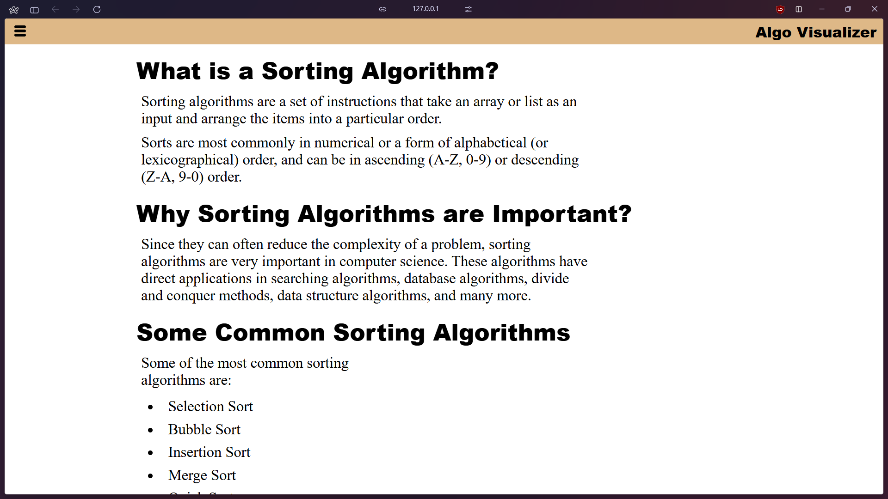

### Sorting Algorithms
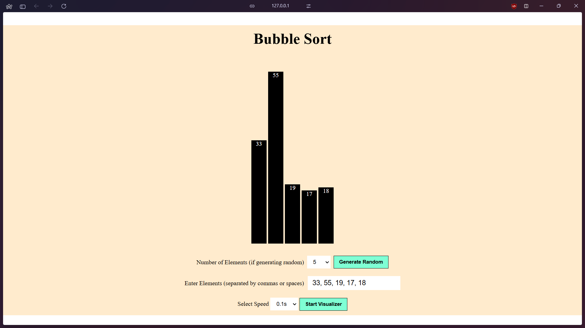
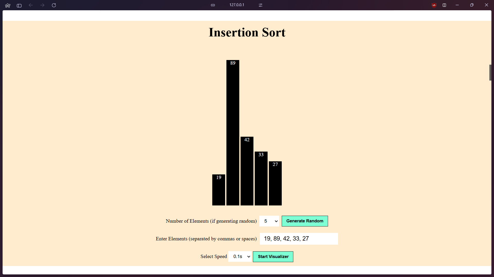
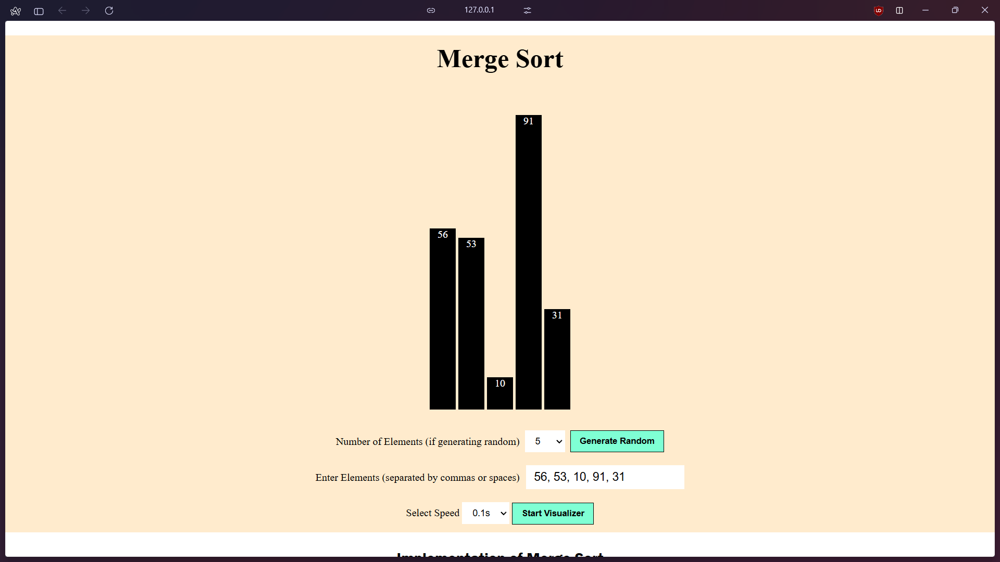
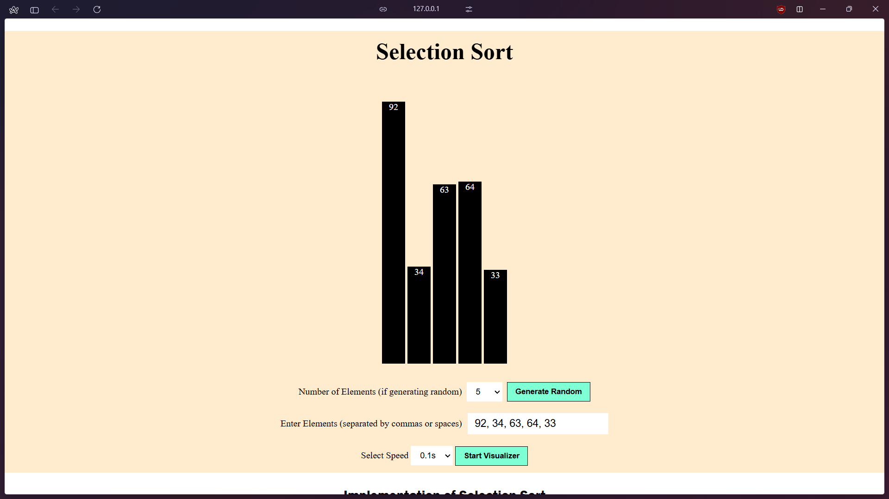

### Stack Operations
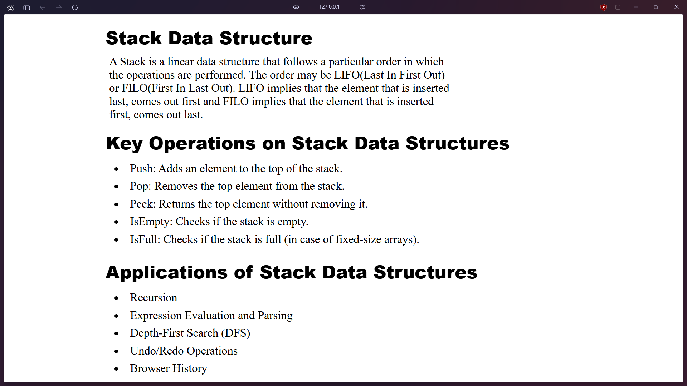
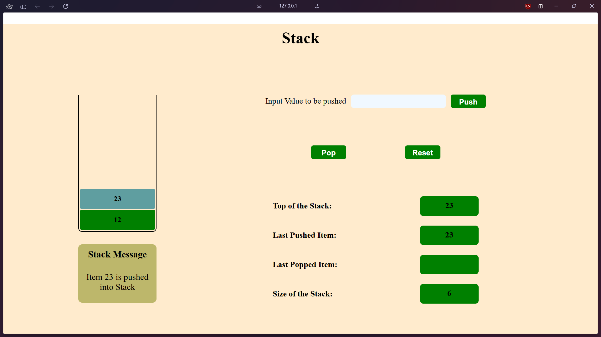

### Queue Operations
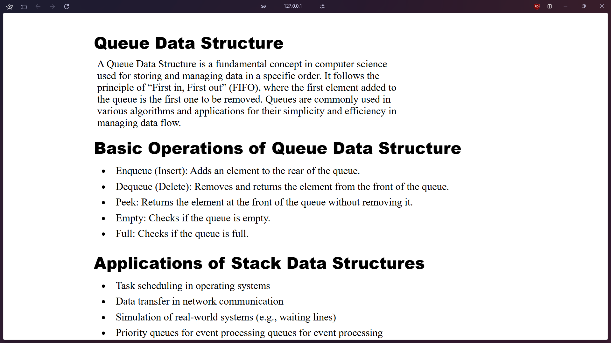
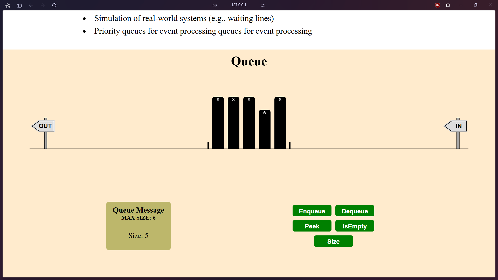

### Their Implementations
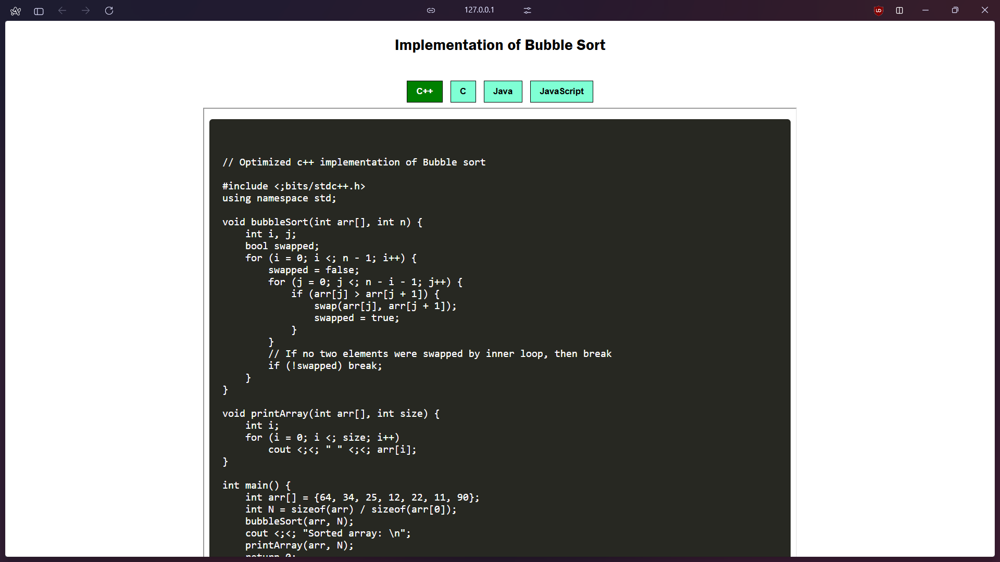

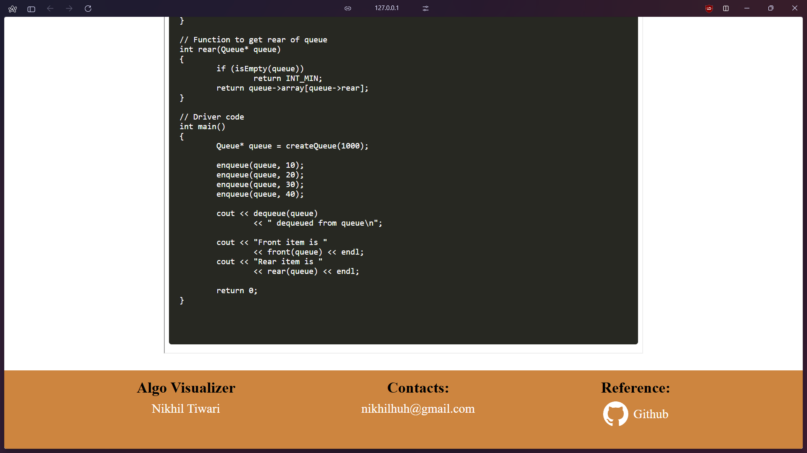


## 🔧 Installation & Usage
1. **Clone the repository:**
   ```bash
   git clone https://github.com/nikhilhuh/Algo-Visualizer.git
   ```
2. **Navigate to the project folder:**
   ```bash
   cd algo-visualizer
   ```
3. **Open the `index.html` file in your browser**
   - No additional setup required, as it is a front-end-only project!

## 🎯 How to Use
1. **Select an Algorithm:** Choose a sorting algorithm or a data structure operation from the menu.
2. **Input Values:** You can input custom values, generate random numbers, or specify the number of inputs for sorting.
3. **Start the Visualization:** Click on the **Start** button to begin the step-by-step execution.
4. **Control Speed:** Adjust the speed of execution for better understanding.
6. **For stack and queue just perform the operations you want to and visualize how it works.
7. **Explore Code & Theory:** View algorithm explanations and copy code snippets in different languages.

## 🏆 Contributing
We welcome contributions! If you’d like to improve this project:
1. Fork the repository.
2. Create a new branch (`feature-new-algo`).
3. Commit your changes.
4. Push to your branch and submit a Pull Request.

## 👨‍💻 Author
- **Nikhil Tiwari** ([GitHub Profile](https://github.com/nikhilhuh))

Feel free to modify and enhance the project. Happy coding! 🚀

